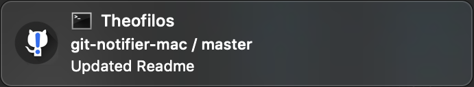

# git-notifier-mac

A simple tool to keep track of changes in git repositories.

<p align="center">  </p>

**git-notifier-mac** will notify you - using a system notification with sound, every time a new commit is made in one of the git repositories it is tracking.

The notification displays useful information about the commit which triggered it, including the repository name and branch, as well as the author and  commit message.

<p align="center">  </p>

Clicking on the notification brings up the corresponding remote's github page, using the default browser.

**git-notifier-mac** can be used to watch for changes by collaborators in team projects, as well as track the progress of public projects. It can track any public or private repo, as long as you have a local git repository linked to it - and corresponding access rights.

**git-notifier-mac** uses JulienXX's [terminal notifier](https://github.com/julienXX/terminal-notifier) to trigger notifications on MacOs.

## Use

* To **add** a new repository to your watchlist, simply run
  
    ``` cli
    ./git-notifier add [absolute-path-to-repo]
    ```

* To **remove** a repo from your watchlist, run
  
    ```cli
    ./git-notifier remove [repo-name]
    ```

* To **list** all git repos in watchlist, run
  
    ```cli
    ./git-notifier list
    ```

* To **start git-notifier** deamon to watch for new commits, run

    ```cli
    ./git-notifier start
    ```

    You can also pass an (optional) argument to specify the frequency with which git-notifier will watch for changes. By default, git-notifier waits 300 seconds between checks.

    ```cli
    ./git-notifier start [(optional) sleep-seconds]
    ```
